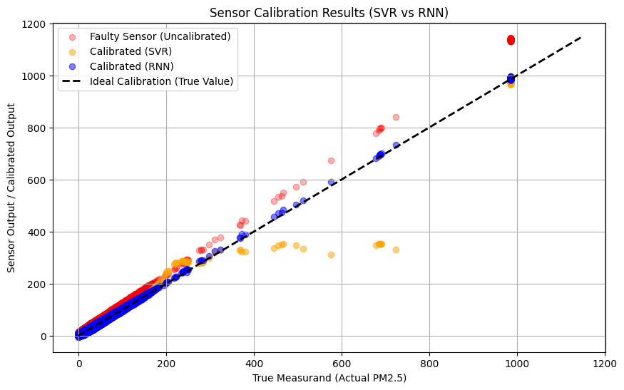

# Sensor Calibration with Machine Learning

Code for our Deep Learning (DIL700) term paper at University West.
The on-device part, where an ESP32 trains and runs the calibration model
itself, is in
[Sensor-Calibration-AI-M5Stick](https://github.com/atakangudulluogluhv/Sensor-Calibration-AI-M5Stick).

## Problem

A sensor reads y = f(x) instead of the true value x. Calibration means
recovering x from y, i.e. learning f⁻¹. We used the PM2.5 column of the
[Air Pollution in Seoul](https://www.kaggle.com/datasets/bappekim/air-pollution-in-seoul)
dataset (647k measurements) as ground truth and simulated a faulty sensor:

```
reading = 1.15 * true + 5 + noise,   noise ~ N(0, 3)
```

The models get the faulty reading as input and predict the true value.
80/20 train/test split.

## Models

We went from simple to more complex:

1. Linear regression
2. Random forest
3. Support vector regression (RBF kernel, trained on a 20k sample because of runtime)
4. A small RNN (SimpleRNN 32 → Dense 16 → 1, Keras)

## Results

On the test set (129,503 samples):

| Model | MSE | R² |
|-------|-----|----|
| SVR   | 14.77 | 0.99 |
| RNN   | 6.61  | 1.00 |



Two things stand out:

- The noise in the simulated reading sets a floor. Inverting the drift
  turns N(0, 3) noise into an error with variance 9 / 1.15² ≈ 6.8, so no
  model can get much below an MSE of about 6.8. The RNN is at that floor.
- SVR does well in the range it was trained on but breaks down above
  roughly 300 µg/m³. Its 20k training sample had very few high values, and
  an RBF kernel doesn't extrapolate. That is where most of its error comes from.

Since the simulated drift is linear, linear regression is in principle
enough here. More complex models only pay off with non-linear drift, such as
drift that depends on temperature or humidity, which would be the next step.

## Running

Download `Measurement_summary.csv` from the Kaggle dataset into this folder,
then open `Sensor Calibration using AI.ipynb`.

Requirements: pandas, numpy, scikit-learn, tensorflow, matplotlib, seaborn.
